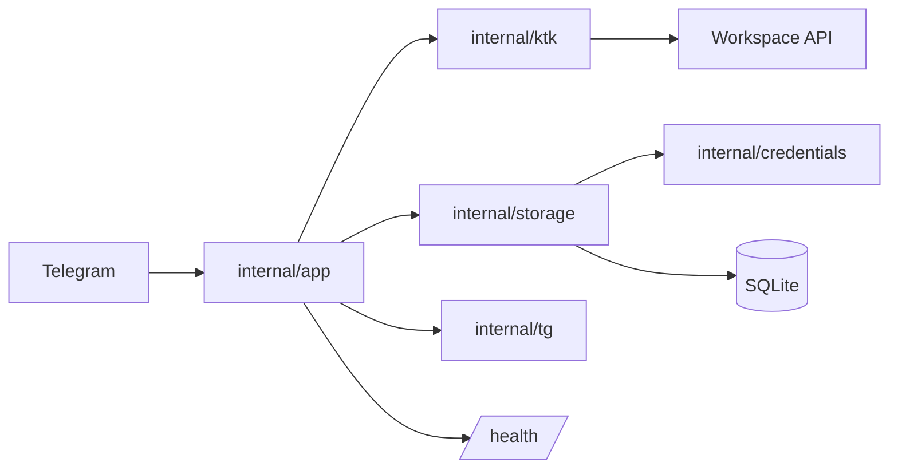

# ktk-schedule

<div align="center">

  <h3>Telegram bot for KTK schedules, notifications, files, and account access.</h3>

  <p>
    <a href="https://go.dev"></a>
    <a href="https://core.telegram.org/bots/api"></a>
    <a href="https://sqlite.org"></a>
    <a href="https://docker.com"></a>
    <a href="./LICENSE"></a>
  </p>

  <p>
    Schedule lookup, grades, attendance marks, files, morning notifications, and health endpoints in one Go service.
  </p>

</div>

---

## Overview

`ktk-schedule` is a Telegram bot for the KTK workspace. It authenticates users, stores credentials in encrypted SQLite, renders schedules in Telegram, and supports grades, attendance marks, files, and scheduled morning notifications.

The project is built for daily use in a production environment. It uses HTTP timeouts, retry wrappers, rate limiting, a circuit breaker, persistent cache, Docker health checks, and graceful shutdown of background work.

## Features

| Area | What it does |
| --- | --- |
| Schedule | Week view, specific dates, today, week switching, day selection |
| Groups | Personal group, other group view, subgroup selection, both subgroups mode |
| Teachers | Teacher-aware sign-in and schedule retrieval |
| Academic data | Lesson time, room, type, current status, grades, attendance |
| Files | Homework attachments and user-uploaded files, day file download |
| Notifications | Morning schedule delivery using `NOTIFY_TIME` and `TIMEZONE` |
| Reliability | Bounded HTTP reads, retries, rate limiting, circuit breaker, schedule cache |
| Operations | `/health`, `/health/extended`, optional `/debug/pprof`, Docker, Forgejo CI/CD |
| Security | AES-GCM password storage, private `/login`, `.env` secrets, SQLite WAL |

## Quick Start

```bash
cp .env.example .env
```

Fill in the required variables:

```dotenv
BOT_TOKEN=123456:telegram-token-from-botfather
CREDENTIALS_SECRET=long-random-secret-at-least-32-chars
```

Generate a secret if needed:

```bash
openssl rand -base64 32
```

Run locally:

```bash
go run ./cmd/bot
```

Run with Docker:

```bash
docker compose up --build -d
docker compose logs -f ktk-schedule
```

## Bot Commands

| Command | Purpose |
| --- | --- |
| `/start` | Show the available commands |
| `/my_id` | Show your Telegram ID |
| `/login login password` | Sign in to the workspace |
| `/schedule` | Open the current week schedule |
| `/schedule 01.09` | Open a schedule for a date in the current academic year |
| `/schedule 2026-09-01` | Open a schedule for an exact date |
| `/group` | Select a group |
| `/subgroup` | Select a subgroup |
| `/subgroups_on` / `/subgroups_off` | Show both subgroups or the selected one |
| `/notify_on` / `/notify_off` | Enable or disable morning notifications |
| `/announce text` | Send an owner announcement |
| `reply /announce` | Broadcast the replied message |
| `/stats` | Show bot statistics to the owner |

`/login` deletes the user message before processing so credentials do not remain in the chat. Login failures and logs must not expose passwords.

## Schedule Output

```text
📅 01.06.2026

1 пара [70 мин] — ОП.12 ИКГ
⏰ 08:00-09:10
🔬 Практическое занятие
👤 Бухтоярова Елена Леонидовна
🏫 Кабинет: 301

2 пара [70 мин] — ОП.02 ДМЭМЛ
⏰ 09:20-10:30
📚 Лекция
👤 Сапожникова Елена Владимировна
🏫 Кабинет: 41

3 пара [70 мин] — ОП.02 ДМЭМЛ
⏰ 11:00-12:10
🔬 Практическое занятие
👤 Сапожникова Елена Владимировна
🏫 Кабинет: 41
```

After `/schedule`, the bot provides inline navigation for days, weeks, file downloads, group switching, and subgroup switching.

## Architecture



| Path | Responsibility |
| --- | --- |
| `cmd/bot` | Entry point, config loading, logging, graceful shutdown |
| `internal/app` | Telegram handlers, sessions, notifications, cache, rate limit, health server |
| `internal/ktk` | Workspace client, parsing, formatting, files, endpoint management |
| `internal/storage` | SQLite schema, migrations, users, encrypted credentials, schedule cache |
| `internal/credentials` | AES-GCM encryption and legacy plaintext migration |
| `internal/config` | `.env` loading and validation |
| `internal/tg` | Inline keyboards and compact callback payloads |
| `.gitea/workflows` | CI/CD, image publishing, deploy, backup, rollback |

The package boundaries are deliberate: Telegram orchestration stays in `internal/app`, workspace logic stays in `internal/ktk`, and persistence stays in `internal/storage`.

## Configuration

All environment variables are documented in [.env.example](./.env.example). The minimum required set is:

| Variable | Description |
| --- | --- |
| `BOT_TOKEN` | Telegram bot token from `@BotFather` |
| `CREDENTIALS_SECRET` | AES-GCM secret, at least 32 characters |
| `OWNER_TELEGRAM_ID` | Owner for `/announce` and `/stats` |
| `KTK_BASE_URL` | Workspace base URL |
| `KTK_DEVICE_NAME` | Device name used in sign-in requests |
| `DEFAULT_GROUP_ID` | Default group after first sign-in |
| `DEFAULT_SUBGROUP` | Default subgroup: `1` or `2` |
| `NOTIFY_TIME` | Morning notification time in `HH:MM` format |
| `TIMEZONE` | Time zone, for example `Asia/Yekaterinburg` |
| `DATABASE_PATH` | Path to the SQLite database |
| `HEALTH_ADDR` | Health server address, default `127.0.0.1:8080` |
| `PPROF_ENABLED` | Enables `/debug/pprof` on the health server |

## Development

Required tools: Go 1.26.4+, `just`, `golangci-lint`, and `govulncheck`. Hot reload uses `air`.

```bash
just setup       # configure .githooks
just setup-air   # install air
just setup-lint  # install golangci-lint
just setup-vuln  # install govulncheck
just dev         # hot reload
just test        # go test -count=1 ./...
just race        # go test -count=1 -race ./...
just lint        # golangci-lint run
just vuln        # govulncheck ./...
just build       # build ./ktk-schedule
just backup      # back up SQLite from the Docker volume
just check       # local verification before handoff
just ci-check    # CI-level verification
```

Recommended before a release-quality change:

```bash
go fmt ./...
go mod tidy -diff
go vet ./...
golangci-lint run
go test -count=1 ./...
go build -trimpath -ldflags="-s -w" -o /dev/null ./cmd/bot
```

Run the race detector for changes in sessions, caches, goroutines, rate limiting, notifications, or circuit breaker logic:

```bash
go test -count=1 -race ./...
```

## Operations

Docker Compose starts the service with a persistent SQLite volume:

```bash
docker compose up --build -d
docker compose logs -f
```

Health endpoints:

| Endpoint | Purpose |
| --- | --- |
| `/health` | Basic process health check |
| `/health/extended` | Extended diagnostics |
| `/debug/pprof` | Profiling, enabled only with `PPROF_ENABLED=true` |

Do not expose the health server or pprof endpoints publicly without access control.

Forgejo CI/CD runs quality checks, builds the Docker image, publishes it to the registry, and deploys it to the VDS. A compressed SQLite backup is created before deployment; if the new container fails health checks, the pipeline attempts a rollback to the previous image.

Repository secrets required for deployment:

| Secret | Purpose |
| --- | --- |
| `REGISTRY_TOKEN` | Access token for the packages/container registry |
| `DEPLOY_NOTIFY_BOT_TOKEN` | Telegram bot token for deployment notifications |
| `DEPLOY_NOTIFY_CHAT_ID` | Chat ID for deployment results |

## Security

- Do not commit `.env`, SQLite databases, logs, backup archives, or the local binary.
- Do not log `BOT_TOKEN`, workspace credentials, encrypted payloads, or raw Telegram input.
- Changing `CREDENTIALS_SECRET` requires users to sign in again.
- Keep Telegram send and copy operations behind the retry wrappers.
- Keep callback payloads within Telegram's 64-byte limit.

## Russian

`ktk-schedule` - Telegram-бот для workspace КТК. Он авторизует пользователей, хранит учетные данные в зашифрованной SQLite, показывает расписание, оценки, посещаемость, файлы и отправляет утренние уведомления.

Проект рассчитан на регулярную эксплуатацию. В нём есть HTTP timeout-ы, retry-обёртки, rate limiting, circuit breaker, persistent cache, health checks в Docker и корректное завершение фоновых процессов.

## Возможности

| Область | Что делает |
| --- | --- |
| Расписание | Просмотр недели, конкретной даты, сегодняшнего дня, переключение недель, выбор дня |
| Группы | Своя группа, другая группа, подгруппы, режим обеих подгрупп |
| Преподаватели | Авторизация преподавателя и получение расписания |
| Данные | Время пары, кабинет, тип занятия, текущий статус, оценки, посещаемость |
| Файлы | Вложения к домашним заданиям и загруженные пользователем файлы |
| Уведомления | Утренние уведомления по `NOTIFY_TIME` и `TIMEZONE` |
| Надежность | Ограниченные HTTP-ответы, retry, rate limiting, circuit breaker, cache |
| Эксплуатация | `/health`, `/health/extended`, optional `/debug/pprof`, Docker, Forgejo CI/CD |
| Безопасность | AES-GCM для паролей, приватный `/login`, `.env`, SQLite WAL |

## Быстрый старт

```bash
cp .env.example .env
```

Обязательные переменные:

```dotenv
BOT_TOKEN=123456:telegram-token-from-botfather
CREDENTIALS_SECRET=long-random-secret-at-least-32-chars
```

Генерация секрета:

```bash
openssl rand -base64 32
```

Локальный запуск:

```bash
go run ./cmd/bot
```

Запуск в Docker:

```bash
docker compose up --build -d
docker compose logs -f ktk-schedule
```

## Команды бота

| Команда | Назначение |
| --- | --- |
| `/start` | Показать доступные команды |
| `/my_id` | Показать свой Telegram ID |
| `/login логин пароль` | Авторизоваться в workspace |
| `/schedule` | Открыть расписание на текущую неделю |
| `/schedule 01.09` | Открыть расписание на дату |
| `/schedule 2026-09-01` | Открыть расписание на точную дату |
| `/group` | Выбрать группу |
| `/subgroup` | Выбрать подгруппу |
| `/subgroups_on` / `/subgroups_off` | Показать обе подгруппы или только выбранную |
| `/notify_on` / `/notify_off` | Включить или выключить утренние уведомления |
| `/announce текст` | Отправить объявление от владельца |
| `reply /announce` | Разослать сообщение из ответа |
| `/stats` | Показать статистику владельцу |

`/login` удаляет сообщение пользователя перед обработкой. Это нужно, чтобы логин и пароль не оставались в чате. Ошибки авторизации и логи не должны раскрывать пароль.

## Формат расписания

```text
📅 01.06.2026

1 пара [70 мин] — ОП.12 ИКГ
⏰ 08:00-09:10
🔬 Практическое занятие
👤 Бухтоярова Елена Леонидовна
🏫 Кабинет: 301

2 пара [70 мин] — ОП.02 ДМЭМЛ
⏰ 09:20-10:30
📚 Лекция
👤 Сапожникова Елена Владимировна
🏫 Кабинет: 41

3 пара [70 мин] — ОП.02 ДМЭМЛ
⏰ 11:00-12:10
🔬 Практическое занятие
👤 Сапожникова Елена Владимировна
🏫 Кабинет: 41
```

После `/schedule` доступна inline-навигация по дням, неделям, файлам, группам и подгруппам.

## Архитектура


| Путь | Ответственность |
| --- | --- |
| `cmd/bot` | Точка входа, загрузка конфигурации, логирование, graceful shutdown |
| `internal/app` | Telegram handlers, sessions, notifications, cache, rate limit, health server |
| `internal/ktk` | Workspace client, parsing, formatting, files |
| `internal/storage` | SQLite schema, migrations, users, encrypted credentials, cache |
| `internal/credentials` | Шифрование AES-GCM и миграция legacy plaintext |
| `internal/config` | Загрузка и валидация `.env` |
| `internal/tg` | Inline-клавиатуры и compact callback payloads |
| `.gitea/workflows` | CI/CD, сборка образа, deploy, backup, rollback |

Разделение по пакетам сохранено намеренно: `internal/app` отвечает за Telegram-логику, `internal/ktk` - за workspace, `internal/storage` - за хранение данных.

## Конфигурация

Все переменные описаны в [.env.example](./.env.example). Минимально необходимые:

| Переменная | Описание |
| --- | --- |
| `BOT_TOKEN` | Токен Telegram-бота от `@BotFather` |
| `CREDENTIALS_SECRET` | Секрет AES-GCM длиной не менее 32 символов |
| `OWNER_TELEGRAM_ID` | Владелец команд `/announce` и `/stats` |
| `KTK_BASE_URL` | Базовый URL workspace |
| `KTK_DEVICE_NAME` | Имя устройства для sign-in запросов |
| `DEFAULT_GROUP_ID` | Группа по умолчанию после первого входа |
| `DEFAULT_SUBGROUP` | Подгруппа по умолчанию: `1` или `2` |
| `NOTIFY_TIME` | Время утренних уведомлений в формате `HH:MM` |
| `TIMEZONE` | Часовой пояс, например `Asia/Yekaterinburg` |
| `DATABASE_PATH` | Путь к SQLite базе |
| `HEALTH_ADDR` | Адрес health-сервера, по умолчанию `127.0.0.1:8080` |
| `PPROF_ENABLED` | Включает `/debug/pprof` на health-сервере |

## Разработка

Нужны Go 1.26.4+, `just`, `golangci-lint` и `govulncheck`. Для hot reload используется `air`.

```bash
just setup       # подключить .githooks
just setup-air   # установить air
just setup-lint  # установить golangci-lint
just setup-vuln  # установить govulncheck
just dev         # hot reload
just test        # go test -count=1 ./...
just race        # go test -count=1 -race ./...
just lint        # golangci-lint run
just vuln        # govulncheck ./...
just build       # собрать ./ktk-schedule
just backup      # backup SQLite из Docker volume
just check       # локальная проверка перед handoff
just ci-check    # проверка уровня CI
```

Рекомендуемый набор перед готовым изменением:

```bash
go fmt ./...
go mod tidy -diff
go vet ./...
golangci-lint run
go test -count=1 ./...
go build -trimpath -ldflags="-s -w" -o /dev/null ./cmd/bot
```

Для изменений в сессиях, кешах, goroutine lifecycle, rate limiter, notifier или circuit breaker нужен `-race`:

```bash
go test -count=1 -race ./...
```

## Эксплуатация

Docker Compose запускает сервис с persistent volume для SQLite:

```bash
docker compose up --build -d
docker compose logs -f
```

Health endpoints:

| Endpoint | Назначение |
| --- | --- |
| `/health` | Базовая проверка процесса |
| `/health/extended` | Расширенная диагностика |
| `/debug/pprof` | Профилирование, только при `PPROF_ENABLED=true` |

Не публикуйте health server и `pprof` наружу без доступа.

Forgejo CI/CD выполняет проверки качества, собирает Docker image, публикует его в registry и деплоит на VDS. Перед обновлением создается backup SQLite; если новый контейнер не проходит healthcheck, pipeline пытается выполнить rollback на предыдущий image.

Repository secrets:

| Secret | Назначение |
| --- | --- |
| `REGISTRY_TOKEN` | Access token для container registry |
| `DEPLOY_NOTIFY_BOT_TOKEN` | Telegram bot token для уведомлений о deploy |
| `DEPLOY_NOTIFY_CHAT_ID` | Chat ID для результатов deploy |

## Безопасность

- Не коммитьте `.env`, SQLite базы, логи, backup-архивы и бинарник.
- Не логируйте `BOT_TOKEN`, workspace-учетные данные, encrypted payloads и raw Telegram input.
- После изменения `CREDENTIALS_SECRET` пользователям нужно войти заново.
- Telegram send/copy операции должны проходить через retry wrappers.
- Callback payloads должны оставаться в пределах лимита Telegram 64 bytes.

## Лицензия

Проект распространяется по лицензии [BSD-3-Clause](./LICENSE).
