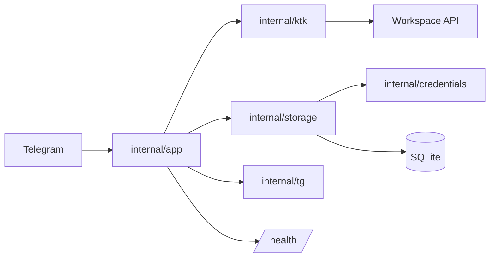

# ktk-schedule

<div align="center">

<p>
  <a href="./README.en.md">English version</a>
</p>

<p>
  <a href="https://go.dev"></a>
  <a href="https://core.telegram.org/bots/api"></a>
  <a href="https://sqlite.org"></a>
  <a href="https://www.docker.com/"></a>
  <a href="./LICENSE"></a>
</p>

<p>
  
  
  
  
</p>

</div>

---

## Русский

Telegram-бот для workspace КТК. Авторизует пользователей, хранит учётные данные в зашифрованной SQLite, показывает расписание прямо в Telegram и отправляет утренние уведомления.

Собран для ежедневной эксплуатации: HTTP-таймауты, retry-обёртки, rate limiting, circuit breaker, persistent cache, Docker health checks, graceful shutdown.

### Возможности

| Область | Что делает |
|---|---|
| Расписание | Неделя, конкретная дата, сегодня, переключение недель, выбор дня |
| Группы | Своя группа, другая группа, подгруппы, режим обеих подгрупп |
| Преподаватели | Вход как преподаватель и просмотр своего расписания |
| Данные | Время пары, кабинет, тип занятия, статус, оценки, посещаемость |
| Файлы | Вложения к домашним заданиям, загруженные файлы, скачивание по дням |
| Уведомления | Утренняя рассылка расписания по `NOTIFY_TIME` и `TIMEZONE` |
| Надёжность | Ограниченные HTTP-ответы, retry, rate limiting, circuit breaker, cache |
| Эксплуатация | `/health`, `/health/extended`, опциональный `/debug/pprof`, Docker, GitHub Actions CI/CD |
| Безопасность | AES-GCM для паролей, приватный `/login`, `.env`, SQLite WAL |

### Быстрый старт

```bash
cp .env.example .env
```

Минимально необходимые переменные:

```dotenv
BOT_TOKEN=123456:токен-от-botfather
CREDENTIALS_SECRET=случайная-строка-не-менее-32-символов
```

Сгенерировать секрет:

```bash
openssl rand -base64 32
```

Запустить локально:

```bash
go run ./cmd/bot
```

Запустить в Docker:

```bash
docker compose up --build -d
docker compose logs -f
```

### Команды бота

| Команда | Назначение |
|---|---|
| `/start` | Показать доступные команды |
| `/my_id` | Показать свой Telegram ID |
| `/login логин пароль` | Авторизоваться в workspace |
| `/schedule` | Расписание на текущую неделю |
| `/schedule 01.09` | Расписание на дату (текущий учебный год) |
| `/schedule 2026-09-01` | Расписание на конкретную дату |
| `/notify_on` / `/notify_off` | Включить или выключить утренние уведомления |
| `/announce текст` | Объявление от владельца всем пользователям |
| `reply /announce` | Разослать сообщение из ответа |
| `/stats` | Статистика бота (только владельцу) |

`/login` удаляет сообщение пользователя сразу после получения — логин и пароль не остаются в чате.

### Формат расписания

```
📅 01.06.2026

1 пара [70 мин] — ОП.12 ИКГ
⏰ 08:00-09:10
🔬 Практическое занятие
👤 Бухтоярова Елена Леонидовна
🏫 Кабинет: 301

2 пара [70 мин] — ОП.02 ДМЭМЛ
⏰ 09:20-10:30
📚 Лекция
👤 Сапожникова Елена Владимировна
🏫 Кабинет: 41
```

После `/schedule` доступна inline-навигация: дни, недели, файлы, группы, подгруппы.

### Архитектура



| Путь | Ответственность |
|---|---|
| `cmd/bot` | Точка входа, загрузка конфига, логирование, graceful shutdown |
| `internal/app` | Telegram-хендлеры, сессии, уведомления, cache, rate limit, health server |
| `internal/ktk` | Workspace-клиент, парсинг, форматирование, файлы, endpoint discovery |
| `internal/storage` | SQLite, миграции, пользователи, зашифрованные credentials, cache |
| `internal/credentials` | AES-GCM шифрование и миграция legacy plaintext |
| `internal/config` | Загрузка и валидация `.env` |
| `internal/tg` | Inline-клавиатуры и compact callback payloads |
| `.github/workflows` | CI/CD, сборка образа, deploy, backup, rollback |

Границы пакетов намеренные: Telegram-логика — в `internal/app`, workspace-логика — в `internal/ktk`, хранение — в `internal/storage`.

### Конфигурация

Все переменные описаны в [.env.example](.env.example). Обязательные:

| Переменная | Описание |
|---|---|
| `BOT_TOKEN` | Токен бота от `@BotFather` |
| `CREDENTIALS_SECRET` | Секрет AES-GCM, не менее 32 символов |
| `OWNER_TELEGRAM_ID` | Telegram ID владельца для `/announce` и `/stats` |
| `KTK_BASE_URL` | Базовый URL workspace (по умолчанию `https://workspace.ktk-45.ru`) |
| `KTK_DEVICE_NAME` | Имя устройства для sign-in запросов |
| `DEFAULT_GROUP_ID` | Группа по умолчанию после первого входа |
| `DEFAULT_SUBGROUP` | Подгруппа по умолчанию: `1` или `2` |
| `NOTIFY_TIME` | Время утренних уведомлений, формат `HH:MM` |
| `TIMEZONE` | Часовой пояс, например `Asia/Yekaterinburg` |
| `DATABASE_PATH` | Путь к SQLite-файлу |
| `HEALTH_ADDR` | Адрес health-сервера, по умолчанию `127.0.0.1:8080` |
| `PPROF_ENABLED` | Включить `/debug/pprof` на health-сервере |

### Разработка

Нужны: Go 1.26.4+, [`just`](https://github.com/casey/just), `golangci-lint`, `govulncheck`. Для hot reload — `air`.

```bash
just setup       # подключить .githooks
just setup-air   # установить air
just setup-lint  # установить golangci-lint
just setup-vuln  # установить govulncheck
```

```bash
just dev         # hot reload (air)
just run         # обычный запуск
just test        # go test -count=1 ./...
just race        # тесты с -race
just lint        # golangci-lint run
just vuln        # govulncheck ./...
just build       # собрать ./ktk-schedule
just check       # полная локальная проверка
just ci-check    # проверка уровня CI
just backup      # backup SQLite из Docker volume
just clean       # удалить бинарник, БД и логи
```

### Эксплуатация

Docker Compose запускает сервис с persistent volume для SQLite:

```bash
docker compose up --build -d
docker compose logs -f
```

Health endpoints:

| Endpoint | Назначение |
|---|---|
| `/health` | Базовая проверка процесса |
| `/health/extended` | Расширенная диагностика |
| `/debug/pprof` | Профилирование, только при `PPROF_ENABLED=true` |

Health-сервер и pprof не должны быть открыты наружу без контроля доступа.

GitHub Actions выполняет проверки качества, собирает Docker image, публикует его в GitHub Container Registry и деплоит на VDS. Перед деплоем создаётся backup SQLite; если новый контейнер не проходит healthcheck — pipeline выполняет rollback на предыдущий image.

### Лицензия

[`BSD 3-Clause License`](https://www.tldrlegal.com/license/bsd-3-clause-license-revised)
